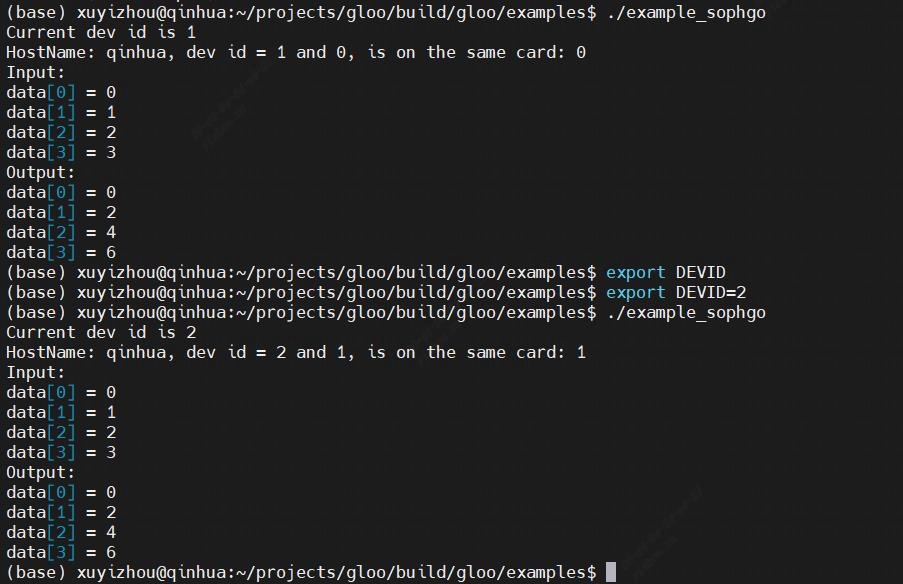

# SOPHON_GLOO

本仓库为添加了用于在SOPHON设备上进行通信的后端代码的GLOO库

## Date 2023.8.9
本仓库中，example1从原本的单机多进程通信改为了单机/多机多进程通信

对于用于通信的主机，需要使用命令：```sudo apt install redis-server``` 安装redis服务
运行该例程，需要参考下面的命令

```bash
# 安装redis
sudo apt-get install libhiredis-dev
mkdir build
cd build
cmake .. -DCMAKE_BUILD_TYPE=Debug -DBUILD_EXAMPLES=1 -DUSE_REDIS=1
make -j4
```

安装redis并编译好之后，直接运行可能会报无法访问redis主机的错误。

这时，需要修改redis配置文件(redis.conf)中的bind选项为0.0.0.0

## Date 2023.8.10
增加example_sophgo.cc

编译命令：

```bash
cmake .. -DCMAKE_BUILD_TYPE=Debug -DBUILD_EXAMPLES=1 -DUSE_REDIS=1 -DUSE_SOPHGO=1
make -j4
```

可以编译通过，可以识别到两个chip是否在同一个机器的同一张卡上

运行结果如下：

